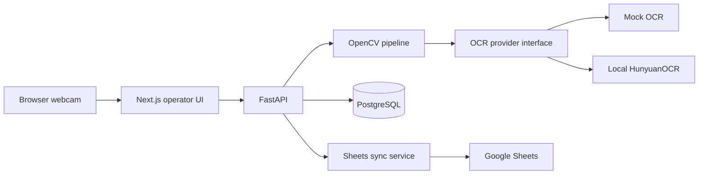

# Career Card Capture

A camera-first data-entry system that turns handwritten Career Services cards into reviewed,
structured records.

```text
Webcam → OpenCV normalization → OCR draft → human review → PostgreSQL → Google Sheets
```

The project is built around a simple rule: OCR can accelerate data entry, but the operator owns
the final answer. Every transcription remains editable, the untouched OCR output is preserved,
and approved records can be corrected later without creating duplicate spreadsheet rows.

## Highlights

- Browser webcam capture with camera selection, permission handling, and keyboard controls
- OpenCV card detection, perspective correction, orientation, and response-area cropping
- Replaceable OCR providers with deterministic mock OCR and local HunyuanOCR via llama.cpp
- Side-by-side image review with fully editable text and response classification
- Persistent events and resumable capture sessions
- PostgreSQL as the source of truth, with Alembic migrations
- Append-only revision history for post-approval corrections
- Reversible card removal that preserves OCR and edit history
- Idempotent Google Sheets synchronization using a stable Record ID
- Credential-independent CSV export
- Privacy-first image retention and no silent cloud OCR fallback
- Docker Compose deployment with PostgreSQL isolated from public host ports

## Current status

The dependable manual-capture workflow is implemented and deployed in a private environment.
The repository currently includes 13 backend tests and 9 frontend tests covering the critical
capture, review, persistence, revision, removal, keyboard, and Sheets-sync behavior.

| Area | Status |
|---|---|
| Events and resumable sessions | Implemented |
| Webcam capture and editable review | Implemented |
| PostgreSQL persistence and migrations | Implemented |
| Historical edits and revisions | Implemented |
| Reversible card removal | Implemented |
| Local HunyuanOCR integration | Implemented; representative benchmark still required |
| Google Sheets sync abstraction | Implemented; live credentials/test Sheet still required |
| CSV export | Implemented |
| Assisted auto-capture | Planned |
| Production hardening and restore drill | Planned |

## Architecture



The browser captures still frames rather than streaming video to the server. FastAPI owns the
business rules, OCR orchestration, persistence, revision history, and synchronization state.
Google Sheets is a derived reporting destination; PostgreSQL remains authoritative.

## Technology

- **Web:** Next.js 16, React 19, TypeScript, Tailwind CSS
- **API:** FastAPI, SQLAlchemy 2, Pydantic, Alembic
- **Vision/OCR:** OpenCV, HunyuanOCR through llama.cpp, pluggable provider interface
- **Data:** PostgreSQL 17 in deployment, SQLite for isolated local verification
- **Integration:** Google Sheets API with service-account support
- **Operations:** Docker Compose and private HTTPS access through Tailscale

## Quick start with Docker

Prerequisites: Docker and Docker Compose.

```bash
cp .env.example .env
# Replace POSTGRES_PASSWORD in .env with a strong local value.
docker compose up --build
```

Open `http://localhost:3000`. You can use a webcam or choose **Try a sample card** to exercise the
workflow without camera hardware. The default Compose configuration uses deterministic mock OCR,
so no model download or external account is required.

Stop the stack without deleting database volumes:

```bash
docker compose down
```

## Local development with HunyuanOCR on Windows

The local OCR runtime and model are stored under ignored `work/local-ocr`; they are never committed
to Git. The pinned CUDA runtime and Q8 model require roughly 3 GB of disk.

One-time PowerShell setup:

```powershell
python -m venv .venv
.\.venv\Scripts\python.exe -m pip install -e ".\apps\api[dev]"
if (-not (Test-Path .\apps\api\.env)) {
  Copy-Item .\apps\api\.env.example .\apps\api\.env
}
Push-Location .\apps\web
npm install
Pop-Location
.\.venv\Scripts\python.exe .\scripts\download_local_ocr.py
```

Start each service in a separate PowerShell terminal:

```powershell
# Terminal 1 — local GPU OCR service
.\scripts\start-local-ocr.ps1
```

```powershell
# Terminal 2 — API and local SQLite database
Set-Location .\apps\api
..\..\.venv\Scripts\python.exe -m alembic upgrade head
..\..\.venv\Scripts\python.exe -m uvicorn app.main:app --host 127.0.0.1 --port 8000
```

```powershell
# Terminal 3 — operator web app
Set-Location .\apps\web
npm run dev
```

Open `http://127.0.0.1:3000`. For a complete two-card OCR lifecycle check:

```powershell
.\.venv\Scripts\python.exe .\scripts\smoke_local_session.py
```

## Verification

Backend:

```powershell
.\.venv\Scripts\python.exe -m ruff check apps/api/app apps/api/tests apps/api/alembic
Push-Location apps/api
..\..\.venv\Scripts\python.exe -m pytest
Pop-Location
```

Frontend:

```powershell
Push-Location apps/web
npm run lint
npm test -- --run
npm run build
Pop-Location
```

GitHub Actions runs the same lint, test, and production-build gates for pushes and pull requests.

## Data integrity and privacy

- Human approval is required before a response becomes authoritative.
- Raw OCR and corrected text are stored separately.
- Historical corrections append revisions instead of erasing the prior value.
- Google retries locate rows by stable Record ID and do not blindly append duplicates.
- A Sheets outage never rolls back a PostgreSQL approval.
- Real card images, transcriptions, credentials, databases, backups, and OCR model files are ignored.
- Local OCR failures degrade to editable manual review and never trigger silent cloud upload.
- The default retention policy deletes captured images after approval.

Do not process real student data with a cloud provider unless the organization has explicitly
authorized that provider and data flow.

## Repository map

```text
apps/web/          Next.js operator interface
apps/api/          FastAPI application, models, migrations, and tests
config/            Non-secret integration schemas
docs/              Product, architecture, privacy, testing, and operations guides
scripts/           OCR setup and end-to-end smoke-test utilities
compose.yaml       Portable application stack
compose.arch.yaml  Example external-volume override for Linux deployment
```

## Documentation

- [Product requirements](docs/PRODUCT_REQUIREMENTS.md)
- [Architecture](docs/ARCHITECTURE.md)
- [Data model](docs/DATA_MODEL.md)
- [API contract](docs/API_CONTRACT.md)
- [Camera and vision pipeline](docs/CAMERA_AND_VISION.md)
- [OCR design](docs/OCR_DESIGN.md)
- [Google Sheets synchronization](docs/GOOGLE_SHEETS_SYNC.md)
- [Security and privacy](docs/SECURITY_PRIVACY.md)
- [Implementation status](docs/IMPLEMENTATION_STATUS.md)
- [Operations runbook](docs/OPERATIONS.md)

## Start here for coding agents

Read in this order before changing implementation code:

1. `AGENTS.md`
2. `docs/PROJECT_CONTEXT.md`
3. `docs/PRODUCT_REQUIREMENTS.md`
4. `docs/ARCHITECTURE.md`
5. `docs/DATA_MODEL.md`
6. `docs/API_CONTRACT.md`
7. `docs/CAMERA_AND_VISION.md`
8. `docs/OCR_DESIGN.md`
9. `docs/UX_WORKFLOWS.md`
10. `docs/GOOGLE_SHEETS_SYNC.md`
11. `docs/DEPLOYMENT_ARCH_TAILSCALE.md`
12. `docs/SECURITY_PRIVACY.md`
13. `docs/TESTING_AND_BENCHMARK.md`
14. `docs/IMPLEMENTATION_PLAN.md`
15. `docs/ACCEPTANCE_CRITERIA.md`
16. `docs/DECISIONS.md`
