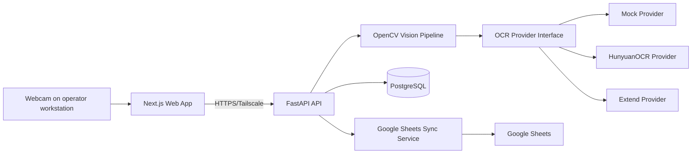
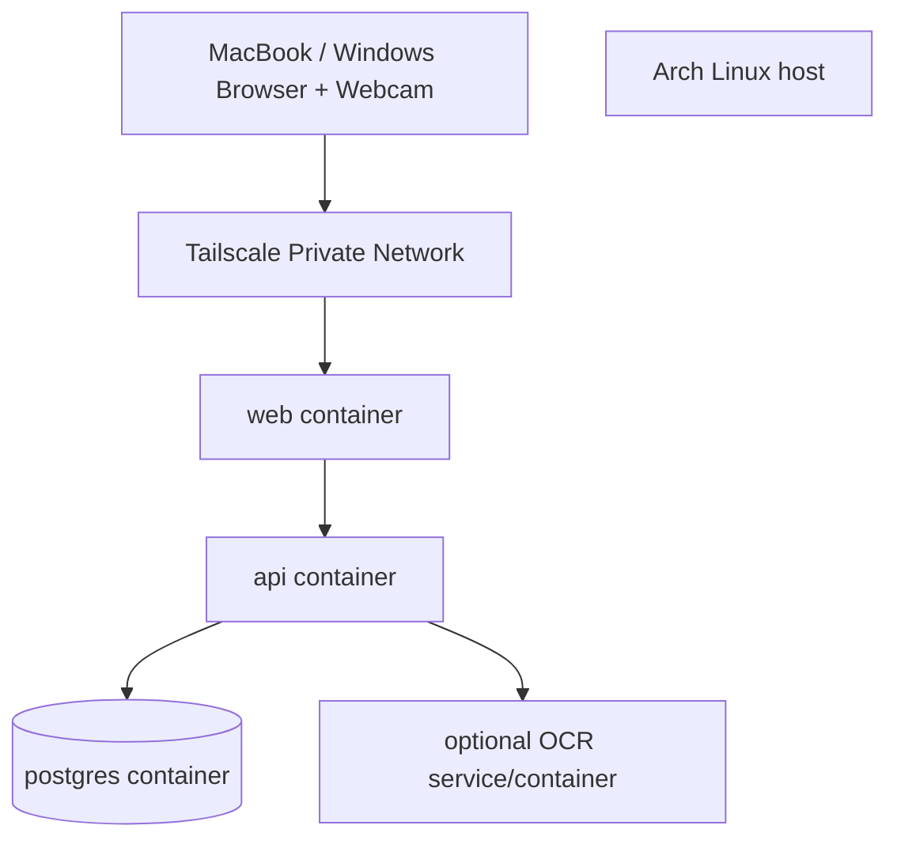

# Architecture

## 1. System overview



## 2. Deployment view



PostgreSQL should be reachable from application containers on a Docker network and not published to the public internet.

## 3. Component responsibilities

### Web application

Responsible for:

- event/session UI
- browser camera permission/preview
- capture controls
- review/edit UI
- keyboard shortcuts
- session resume/history
- basic stats
- API communication

The browser should capture still frames from the live video stream and send images to the API. Do not stream 1080p video continuously to the server for V1.

### FastAPI

Responsible for:

- business rules
- persistence
- image-processing orchestration
- OCR provider orchestration
- revision creation
- sync-outbox creation
- event/session/card APIs
- health/readiness endpoints

### Vision pipeline

Responsible for:

- locating card boundaries
- choosing/correcting orientation
- perspective correction
- cropping the response region
- optional contrast/sharpness normalization
- returning quality metrics

Do not bake OCR-provider logic into OpenCV code.

### OCR interface

Contract:

```python
class OCRProvider(Protocol):
    async def extract(self, image: bytes, context: OCRContext) -> OCRResult:
        ...
```

Conceptual result:

```json
{
  "raw_text": "Fox Sports",
  "suggested_type": "EMPLOYER",
  "confidence": 0.96,
  "provider": "hunyuan",
  "model": "HunyuanOCR-1.5",
  "provider_metadata": {}
}
```

`confidence` is optional/nullable because different providers may not return directly comparable scores. UI must not imply cross-provider calibration.

### PostgreSQL

Authoritative store for:

- events
- sessions
- cards/responses
- revisions
- OCR attempts
- sync state/outbox
- optional image metadata

### Google Sheets sync

Runs only for approved responses.

Use an outbox/idempotency pattern:

1. DB transaction saves approval/edit.
2. Same transaction creates or updates a pending sync intent.
3. sync worker/service processes pending intents.
4. success stores external row identity/state.
5. failure is retried or surfaced.

## 4. Source-of-truth boundaries

| Data | Source of truth |
|---|---|
| Event/session metadata | PostgreSQL |
| Card raw OCR | PostgreSQL |
| Final corrected text | PostgreSQL |
| Revision history | PostgreSQL |
| Google Sheet row | Derived/synchronized |
| Browser camera preference | Browser local storage |
| OCR provider config | Environment/config |
| Secrets | Environment/secret file, never repository |

## 5. Image lifecycle

Recommended V1:

- capture image in browser,
- upload to API,
- create normalized card crop,
- retain while card is in review,
- after approval follow configurable retention policy.

Config examples:

- `delete_after_approval` — privacy-first default
- `retain_normalized_crop` — if organizational policy permits
- `retain_for_days=N` — future option

Do not design core data integrity around permanent image retention.

## 6. Background work

V1 can use a small in-process/background worker for low volume, but code sync behind an explicit queue/outbox interface so a dedicated worker can be introduced later.

Do not introduce Kafka/Redis/Celery merely for architecture aesthetics. Add infrastructure only when needed.

## 7. Error boundaries

Vision failure:
- keep captured frame,
- allow manual crop/retry/manual transcription.

OCR failure:
- move card to review with empty editable text and error indicator.

Google Sheets failure:
- approval remains successful in PostgreSQL,
- sync status becomes error/pending,
- operator can retry.

Database failure:
- do not show approval as successful.

## 8. Portability

No component may depend on a hard-coded host path, IP, or public domain.

All deploy-specific values come from environment/configuration.
